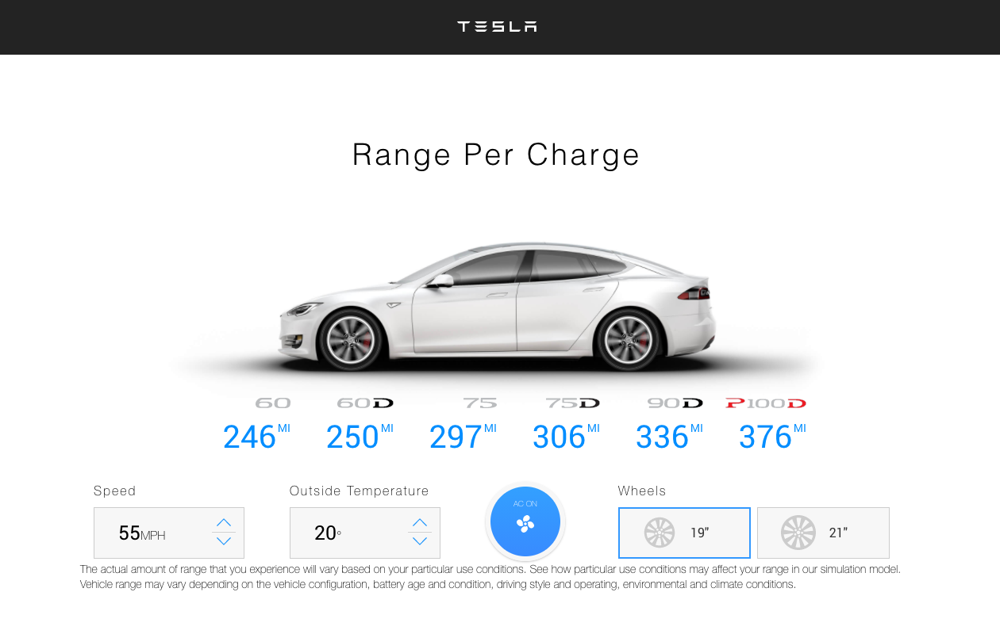

# Tesla's Battery Range Calculator with React
Tesla's Battery Range Calculator built using React.JS, Redux and a few animations.
[</img>]

## Table of Contents

- [Deployed Application](#Deployed)
- [Technologies Used](#Technologies)
- [License](#License)
- [Contributors](#Contributors)
- [Questions](#Questions)

## Deployed Application
[</img>](https://pensive-kepler-4f372d.netlify.app/)

[Demo Link](https://pensive-kepler-4f372d.netlify.app/)

## Technologies Used
  - React.js
  - Redux
  - CSS Animations
  - Animista

## License

## Contributors
Github: [Tima Nlemvo](https://github.com/timanlemvo)

## Questions
Github: [Tima Nlemvo](https://github.com)  
Email: [Tima Nlemvo](timanlemvo@gmail.com)

“Whether you want to uncover the secrets of the universe, or you just want to pursue a career in the 21st century, basic computer programming is an essential skill to learn.”

-- Stephen Hawking 

